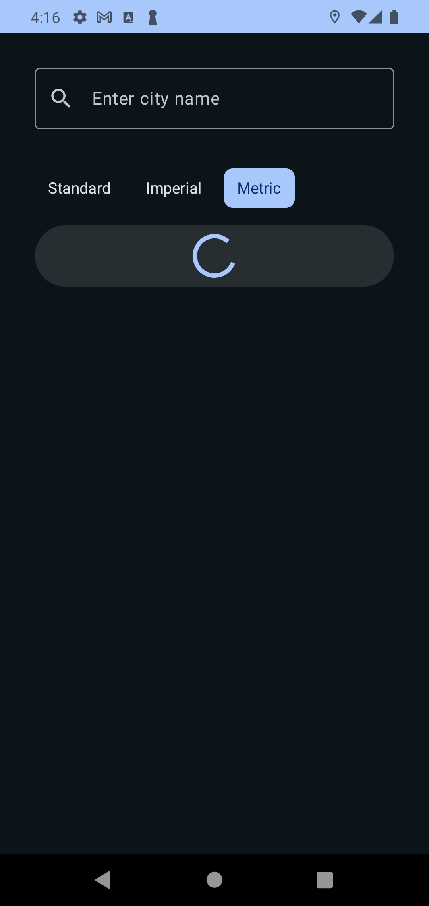
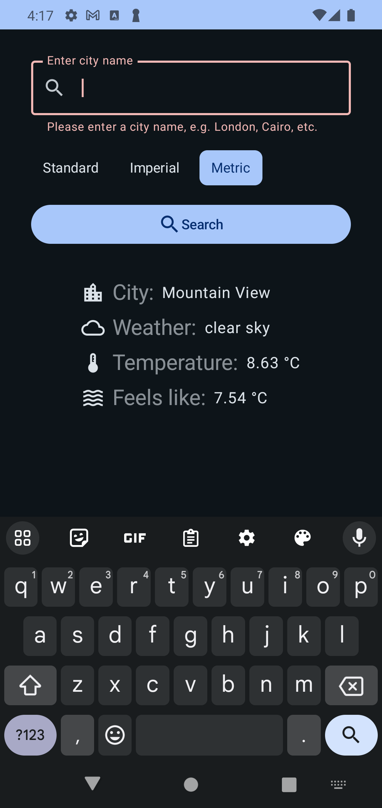

# ⛈️ Weather Search App

## 🕹️ Overview

The Weather Search App is a robust Android application 📱 that serves weather information ☁️🌤️🌩️ for a specific location
using the [OpenWeatherMap API](https://openweathermap.org/api).

## 💡 Features

- 🔍 Search for weather information based on city name.
- 🌡️ View current weather conditions including temperature, humidity, wind speed, etc.
- 📍 Shows data for the user's current location by default.
- 🌓 Dark mode support for better usability in low-light environments.
- 🎨 Material3 (Material You) design for a modern and consistent user experience.
- 🔀 Support for both portrait and landscape orientations.
- 🧪 Unit testing.
- 🛠️ Integration testing.
- 🖥️ UI Tests.

## 📸 Screenshots

 

 

## 🚀 Installation

To smoke up the Weather Search App on your local machine 💻 , follow these steps:

1. 🔑 Git clone this repository to your local machine
   using `git clone https://github.com/ahmed3elshaer/weather-search.git`
2. 🖥️ Open the project in Android Studio.
3. 🏗️ Build and run the project on an emulator or physical device.

## 🛠️ Usage

1. Upon launching the app, you'll be greeted with a search bar.
2. 🔐 The app will request the user to grant the location permission.
3. 🌍 The app will display the current weather conditions for the user's current location.
4. 📝 Enter the name of the city for which you want to check the weather and press the search button.
5. 📊 The app will display the current weather conditions for the specified location or the city name in the case of
   search.

## 🏗️ Technologies

The Weather Search App hinges on the following technologies:

- [Kotlin](https://kotlinlang.org/) - The programming language used for crafting the app.
- [Jetpack Compose](https://developer.android.com/jetpack/compose) - A modern toolkit to build native UI.
- [Android Jetpack](https://developer.android.com/jetpack) - A suite of libraries, tools, and guidance for developers.
- [Hilt](https://developer.android.com/training/dependency-injection/hilt-android) - A robust dependency injection
  library for Android.
- [ViewModel](https://developer.android.com/topic/libraries/architecture/viewmodel) - A class storing and managing
  UI-related data.
- [Play Services Location](https://developers.google.com/android/guides/setup) - APIs for accessing location data.
- [Retrofit](https://square.github.io/retrofit/) - A type-safe HTTP client for Android and Java.
- [GLIDE](https://bumptech.github.io/glide/) - A fast and efficient image loading library for Android.
- [Material3 (Material You) Components for Android](https://material.io/develop/android/docs/getting-started/) - A
  library providing reusable UI components.
- [Coroutines](https://kotlinlang.org/docs/coroutines-overview.html) - A library for asynchronous programming.
- [Kotlin Flow](https://kotlinlang.org/docs/flow.html) - For asynchronous data handling.

## 🏢 Architecture

This project adopts the robust **MVVM** (Model-View-ViewModel) architecture pattern, which provides a clear separation
of concerns. The user interface is separated from the business logic, providing the merits of modular and testable code.

- **DATA**: Contains the data sources and repositories for fetching weather data from OpenWeatherMap API and retrieving
  the user's current location.
- **DOMAIN**: Contains the business logic, use cases, and structural models for the application. e.g., the Weather model
  and the GetWeatherUseCase.
- **UI**: Composes the visual interfaces and view models of the application.

Further, the application features the single activity architecture paradigm, adhering to the modern Android development
practices.

## 📂 Project Structure

The project exhibits Google's recommended app architecture. It is divided into specific packages, ensuring clean code
and easy navigation.
This project doesn't necessitate the complexity of multi-module architecture; the package-based architecture has been
deemed more suitable.
